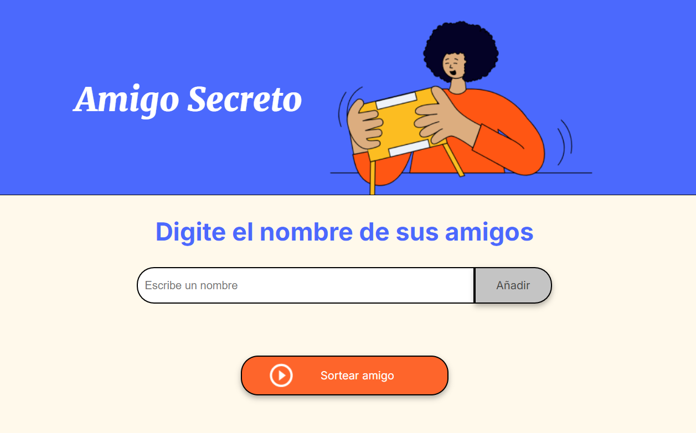

# 🧙‍♂️ Amigo Secreto

Este es un proyecto desarrollado como parte de un desafío de curso. La aplicación permite a los usuarios ingresar nombres de amigos, visualizar la lista y realizar un sorteo para determinar quién será el "amigo secreto".

---

## ✨ Funcionalidades

- **Agregar nombres**: Los usuarios pueden agregar nombres a una lista a través de un campo de texto y un botón.
- **Validar entradas**: Se valida que los nombres no estén vacíos o repetidos.
- **Visualizar la lista**: Los nombres agregados se muestran en una lista interactiva.
- **Sortear un amigo**: Con un clic en el botón de sorteo, se elige un amigo secreto al azar de la lista. Después del sorteo, la lista se reinicia automáticamente.

---

## 📝 Cómo usar la aplicación

1. **Ingresa un nombre**  
   En el campo de texto, escribe el nombre de un amigo que deseas agregar a la lista.

2. **Añade el amigo**  
   Haz clic en el botón **"Añadir"** para incluir el nombre en la lista de amigos. Si dejas el campo vacío o intentas agregar un amigo ya registrado, recibirás una alerta.

3. **Sortea el amigo secreto**  
   Una vez que tengas al menos dos amigos en la lista, haz clic en el botón **"Sortear amigo"** para realizar el sorteo. Se mostrará el resultado en pantalla, y la lista de amigos se reiniciará automáticamente para que puedas realizar otro sorteo.

### Ejemplo de la interfaz



---

## 🛠️ Tecnologías utilizadas

- **HTML**: Estructura básica proporcionada para el desafío.
- **CSS**: Estilos básicos para la interfaz.
- **JavaScript**: Desarrollo de la lógica de la aplicación.

---

## 📂 Estructura del proyecto

```
📦 amigo-secreto
├── index.html       # Archivo base del proyecto
├── styles.css       # Estilos de la aplicación
├── app.js           # Lógica de la aplicación en JavaScript
└── README.md        # Documentación del proyecto
```

---

## 🤝 Contribuciones

Si deseas contribuir, ¡eres bienvenido/a! Puedes abrir un Pull Request o sugerir ideas en la sección de Issues.

---

## 🏷️ Créditos

Desarrollado como parte de un desafío del curso **ONE - Oracle Next Education**.
